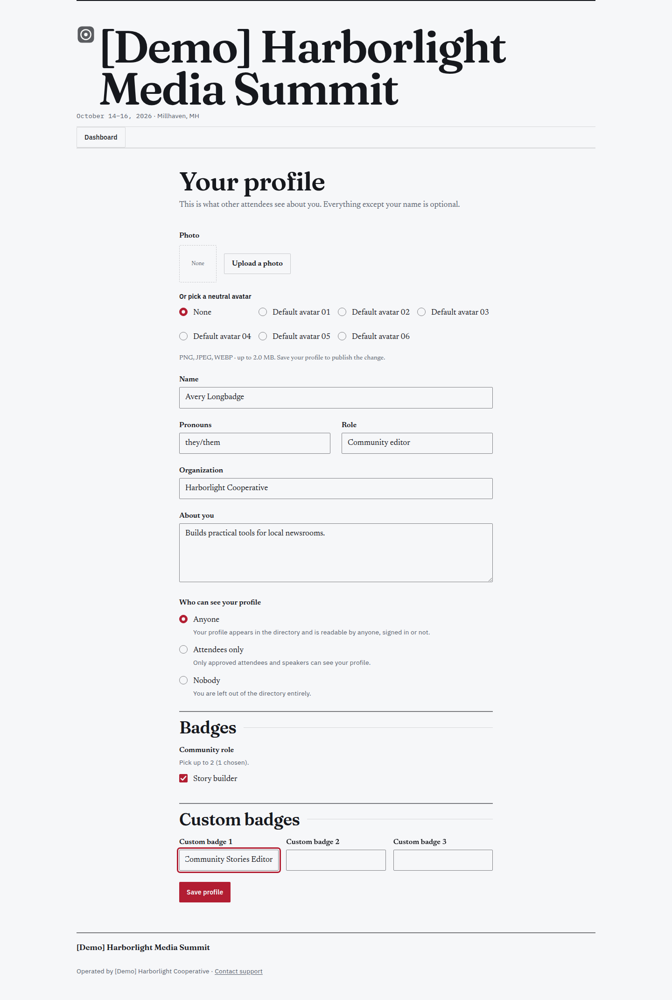
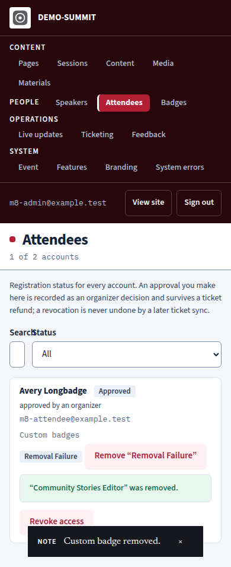

# M8 repair preview evidence

Captured 2026-09-11 from the repair branch against local Auth and Firestore emulators with synthetic accounts. These are preview screens, not a client deployment. Chromium ran with its sandbox enabled. Controls were operated by accessible role and label.

The profile save used the real Firestore client. The moderation screen used a local HTTP support server that applied the expected emulator document change; endpoint authorization and audit behavior are covered separately by function tests. Public projections were seeded for the browser check.

The profile accepts up to three custom badges when the feature is enabled. The first value below has 24 characters.

The staff screen confirms removal and keeps the result beside the affected attendee. This phone capture shows the remaining badge and the completed removal message.

The local directory captures preceded the final sidebar count correction; focused tests verify that the count includes permitted custom badges and excludes blocked values.

The full local evidence set also covers invalid-value focus, public directory and detail tags, disabled feature behavior, removal confirmation and failure at desktop and phone widths, and desktop schedule time and popularity ordering. No browser page errors occurred.
